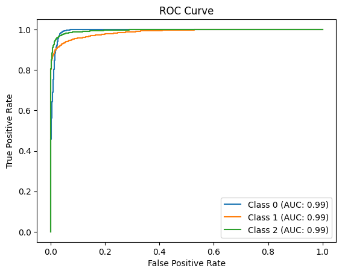

# Multi-Class Classification (Common Task)

This directory contains my solution for **Task I: Multi-Class Classification**. The task involves classifying lensing images into three categories using a deep learning model.

---

## Task Summary

- **Goal:** Classify images into three classes:
  - Class 0: No substructure
  - Class 1: CDM substructure
  - Class 2: Axion substructure
- **Framework:** PyTorch
- **Architecture:** EfficientNet-B0

---

## Model

- Used `EfficientNet-B0` pretrained weights
- Modified for grayscale input (`in_channels=1`)
- Final classification layer outputs 3 classes

---

## Training Details

- **Loss:** CrossEntropyLoss
- **Optimizer:** Adam
- **Scheduler:** StepLR (decay every 5 epochs)
- **Epochs:** 20
- **Data Augmentation:** Horizontal flip, rotation
- **Normalization:** Mean = 0.5, Std = 0.25
- **Train/Val Split:** 90/10 from training dataset

---

## 📈 Results

- **Best Validation Macro AUC:** `0.9906`
- **Test Set Mean AUC:** `0.9913`

### ROC Curve

---
