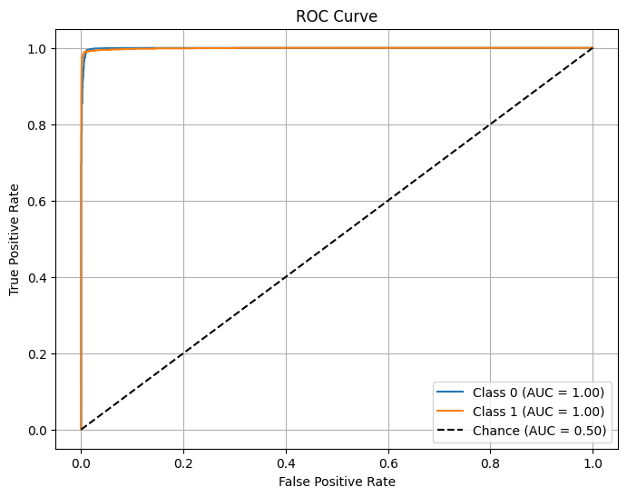

# Lens Finding (Task II)

This directory contains my solution to **Task II: Lens Finding** for the DeepLense GSoC 2025 evaluation. The task is a binary classification problem: detecting strong gravitational lenses from astronomical images.

---

## Task Overview

- **Goal:** Classify images as either:
  - `Class 0`: Non-lensed galaxy
  - `Class 1`: Strong gravitational lens
- **Framework:** PyTorch
- **Input:** Multi-band astronomical images (shape: 3 × 64 × 64)
- **Split:** 90% training, 10% validation, test set provided separately

---

## Model

- Pretrained **ResNet-34** backbone
- Fine-tuned for binary classification
- Trained on GPU (`cuda`)

---

## Training Details

- **Loss Function:** CrossEntropyLoss
- **Optimizer:** Adam (`lr = 1e-4`)
- **Epochs:** 10
- **Augmentation:** Resize to 64×64, normalize per channel

---

## Results

- **Best Validation Macro AUC:** `0.9881`
- **Test Accuracy:** `99.66%`
- **ROC-AUC Score:** `0.9990`
- **Per-Class Recall:**
  - Class 0 (Non-lens): `99.88%`
  - Class 1 (Lens): `95.90%`

---

### ROC Curve (Test Set)

---
