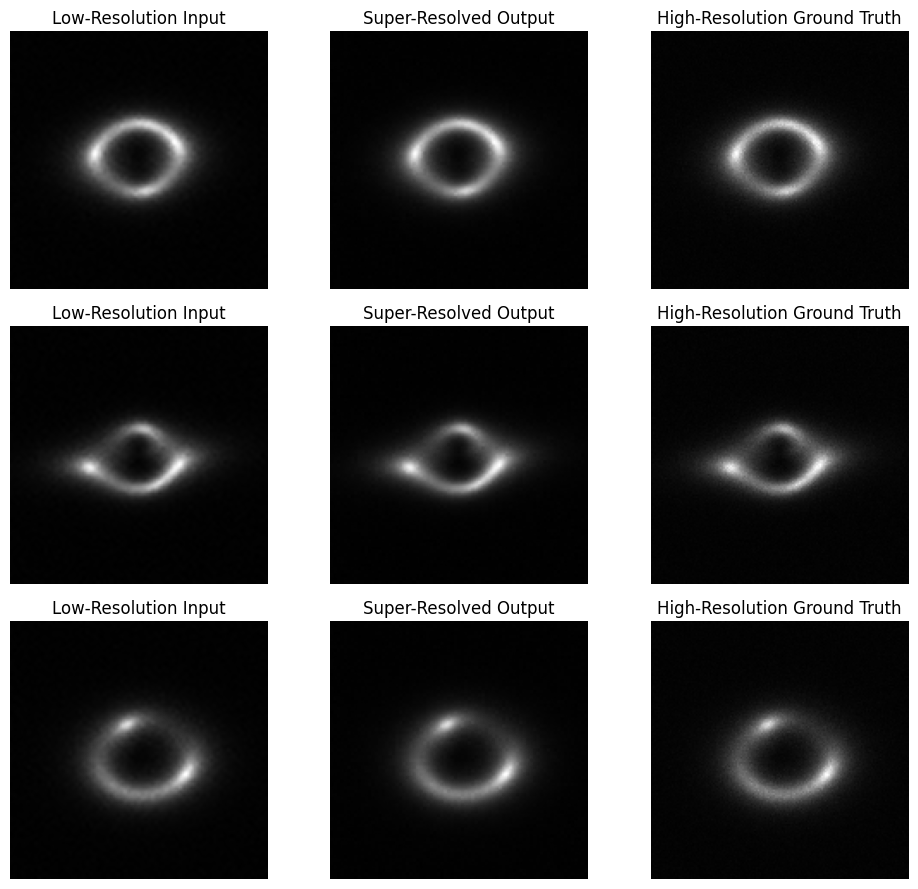
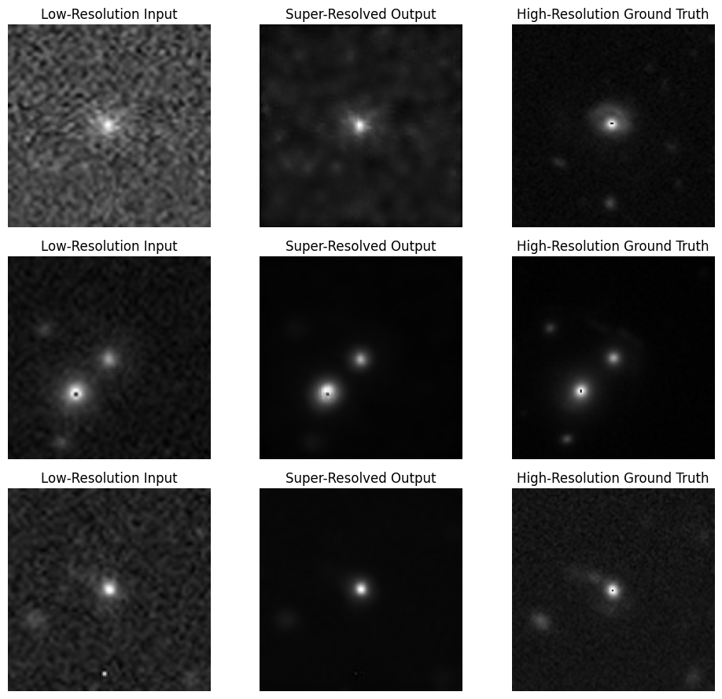

# Super-Resolution (Task III.A & III.B)

This directory contains my implementations for the **super-resolution tasks**:

- **Task III.A**: Synthetic HR/LR image super-resolution
- **Task III.B**: Super-resolution on real lensing data with transfer learning and augmentation

---

## Task III.A – Synthetic Super-Resolution
 
- **Goal:** Reconstruct high-resolution (150×150) images from low-resolution (75×75) simulated lensing images.
- **Model:** RCAN (Residual Channel Attention Network)
- **Framework:** PyTorch
- **Training Epochs:** 10

## Model Architecture

**Residual Channel Attention Network (RCAN)**  
- 10 Residual Groups  
- Each with 20 RCAB blocks  
- Channel attention with reduction ratio = 16  
- Final output: HR reconstruction using upsampling and transposed convolutions

### Final Test Metrics

| Metric | Score |
|--------|-------|
| L1 Loss | 0.0049 |
| MSE Loss | 0.0001 |
| PSNR | 42.32 dB |
| SSIM | 0.9745 |

### Sample Outputs

---

## Task III.B – Real Super-Resolution

- **Goal:** Super-resolve real astronomical LR images using limited HR/LR pairs.
- **Approach:** Fine-tuned RCAN model from Task III.A using real data with augmentation.
- **Augmentations:** Flipping, rotation, and noise injection
- **Training Epochs:** 50 (with early checkpointing)

### Final Test Metrics

| Metric | Score |
|--------|-------|
| L1 Loss | 0.0174 |
| MSE Loss | 0.0013 |
| PSNR | 29.95 dB |
| SSIM | 0.8217 |

### Sample Outputs

---
