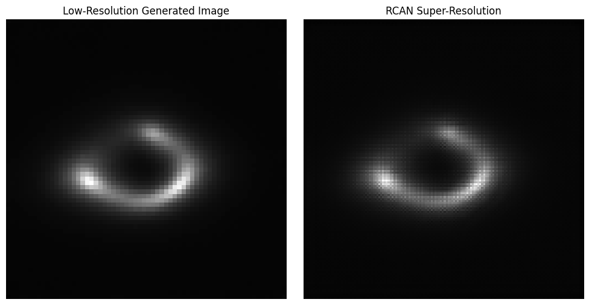
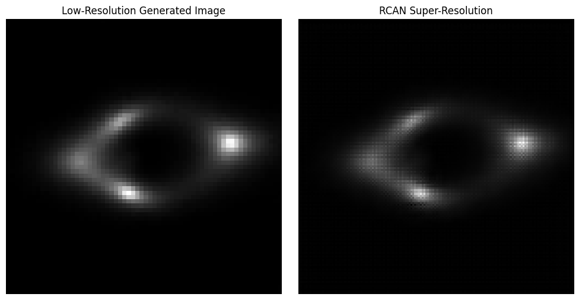
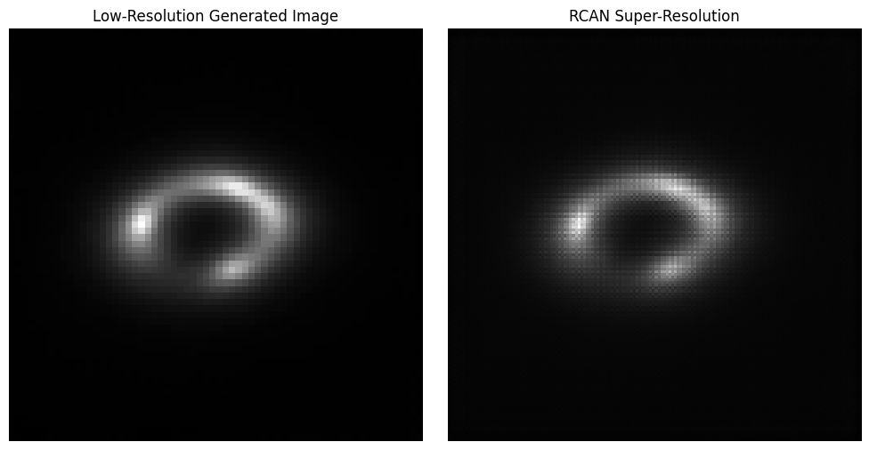

# Diffusion Models (Task IV)

This directory contains my solution to **Task IV: Diffusion Models** for the DeepLense GSoC 2025 evaluation. The task focuses on generating realistic strong gravitational lensing images using **denoising diffusion probabilistic models (DDPMs)** and evaluating their visual and statistical fidelity.

---

## Task Overview

- **Goal:** Generate synthetic strong lensing images using a DDPM-based generative model
- **Framework:** PyTorch
- **Input:** Random noise sampled from a normal distribution
- **Output:** Realistic 64×64 images, upsampled to 150×150 using a Super-Resolution model

---

## Model Architecture

### DDPM – Generative Backbone

- **Base model:** U-Net with time-embedding and attention
- **Time Embedding:** Sinusoidal + learnable projection (dim=128)
- **Channels:**  
  - Down: `[32, 64, 128, 256]`  
  - Mid: `[256, 256, 128]`
- **Heads:** Multi-head self-attention at every stage
- **Diffusion Steps:** 1000
- **Noise Schedule:** Linear β from 1e-4 to 2e-2

### RCAN – Super-Resolution Upsampler

- **Architecture:** Residual Channel Attention Network (RCAN)
- **Input:** 64×64 DDPM output
- **Output:** 150×150 upsampled image
- **Upsampling:** Transpose convolution + bicubic interpolation
- **Residual Groups:** 10
- **Blocks per Group:** 20
- **Features:** 64

---

## Training Details

### DDPM

- **Dataset:** 10,000 synthetic lensing images
- **Preprocessing:** Downsampled from 150×150 to 64×64
- **Loss Function:** MSE between predicted and true noise
- **Optimizer:** Adam (`lr = 1e-4`)
- **Epochs:** 10
- **Batch Size:** 4

### RCAN

- **Training Pairs:** (LR, HR) = (64×64, 150×150)
- **Loss Function:** L1 loss (pixel-wise)
- **Optimizer:** Adam
- **Epochs:** 10
- **Batch Size:** 8

---

## Results

### Evaluation Protocol

- Generated **300 images** using trained DDPM
- Used pretrained **VGG16** to extract deep features
- Matched generated images to real images based on Euclidean distance
- Evaluated image fidelity using **PSNR** and **SSIM**

### Metrics

| Metric | Score     |
|--------|-----------|
| PSNR   | **22.05** |
| SSIM   | **0.9306** |

---

### Visual Output

Below: samples generated by DDPM (left) and enhanced via RCAN (right)

---
