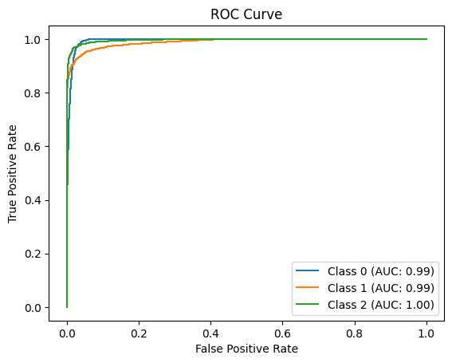

# Physics-Informed Transformers (Task IV)

This directory contains my solution to **Task IV: Physics-Informed Transformers**. The goal was to design a deep learning model that combines astrophysical theory with modern transformer architectures for classifying strong gravitational lenses.

---

## Task Overview

- **Goal:** Classify images into one of three categories:
  - Class 0: No substructure
  - Class 1: CDM substructure
  - Class 2: Axion substructure
- **Framework:** PyTorch
- **Input Shape:** (1 × 150 × 150)
- **Evaluation Metric:** Macro-AUC

--- 

## Architecture

### PhysicsInformedFusionNet

This model combines:
1. **Physics-Informed Transformer Branch**
   - Uses the **SIS lens equation** to approximate inverse lensing
   - Implements a transformer-based module to estimate the lensing parameter `k`
   - Physically reconstructs the source image before classification

2. **EfficientNet-B0 Branch**
   - Pretrained on ImageNet
   - Modified to accept 2 input channels (original image + reconstructed source)
   - Final layer adapted for 3-class output

### Core Components

- **RelativisticPhysicalInformedEncoder**
  - Applies the inverse lens equation using learned physics-informed attention
- **MultiLocallySelfAttention (MLSA)**
  - Enforces spatial locality in attention computation
- **Patch-based Transformers**
  - Tokenization via unfolding 2D image patches

---

## Training Details

- **Loss Function:** CrossEntropyLoss
- **Optimizer:** Adam (`lr = 1e-3`, weight decay = 1e-5)
- **Scheduler:** StepLR (decay every 5 epochs)
- **Epochs:** 50
- **Data Augmentation:** Horizontal flip, random rotation
- **Input Normalization:** Per-channel with `(mean=0.5, std=0.25)`

---

## Results

| Metric       | Value     |
|--------------|-----------|
| Best Val AUC | `0.9924`  |
| Test AUC     | `0.9933`  |

### ROC Curve (Test Set)

- **Class 0 (no-sub):** AUC ≈ 0.99
- **Class 1 (cdm):** AUC ≈ 0.99
- **Class 2 (axion):** AUC ≈ 1.00

---

## Model weights

The `.pth` file for this model exceeds GitHub's file size limits.  
You can download the model weights from the following Google Drive link:  

[Download Model Weights](https://drive.google.com/file/d/1DK-f1eRkcZxUe6KEeewP5K--mECwXyyi/view?usp=sharing)

---

## Acknowledgements

⚠️ This implementation was inspired by the excellent work of [Lucas Veloso](https://medium.com/@lucas.jose.veloso.de.souza/lensiformer-a-relativistic-physics-informed-vision-transformer-architecture-for-dark-matter-a119f6d0dc0d).  
Specifically, the physics-informed transformer module and inverse-lensing encoder were adapted from the [Lensiformer GitHub repository](https://github.com/ML4SCI/DeepLense/tree/main/Physics_Informed_Transformers_For_Dark-Matter_Morphology_Lucas_Jose).

---
